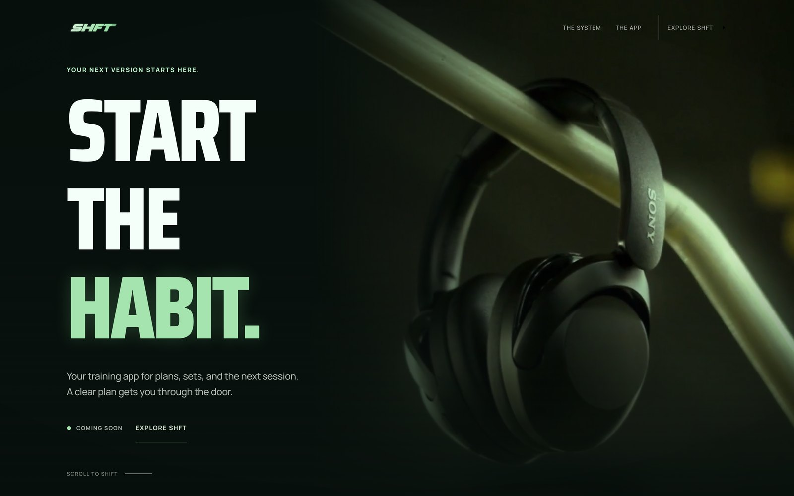
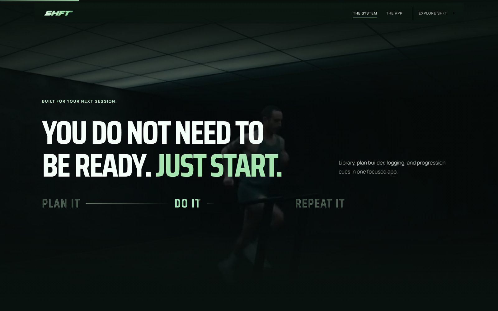
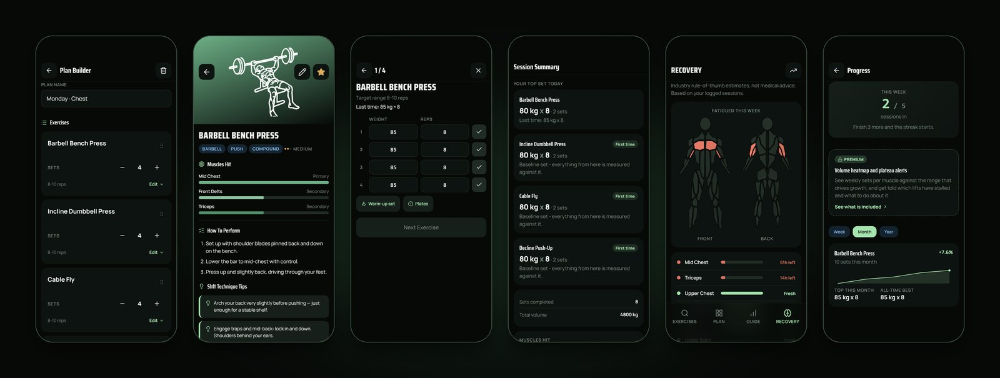
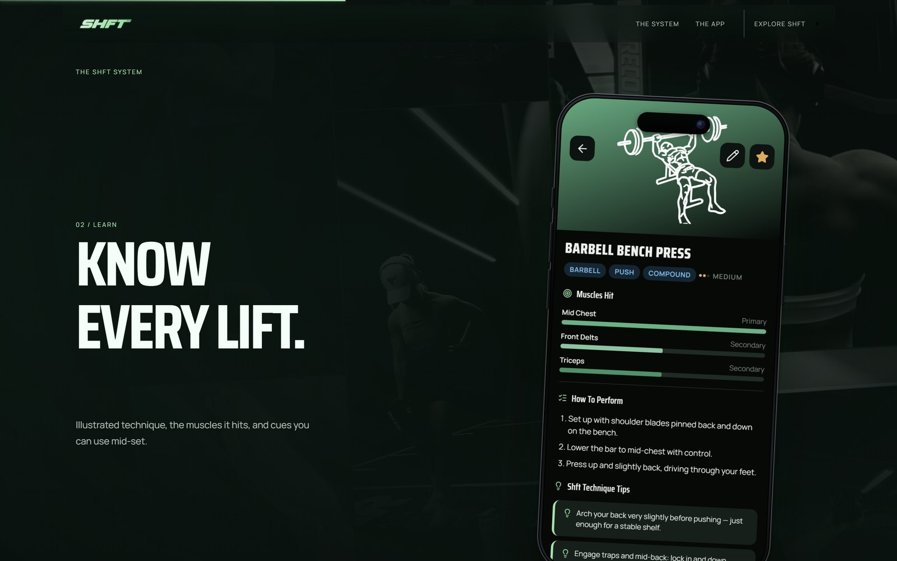
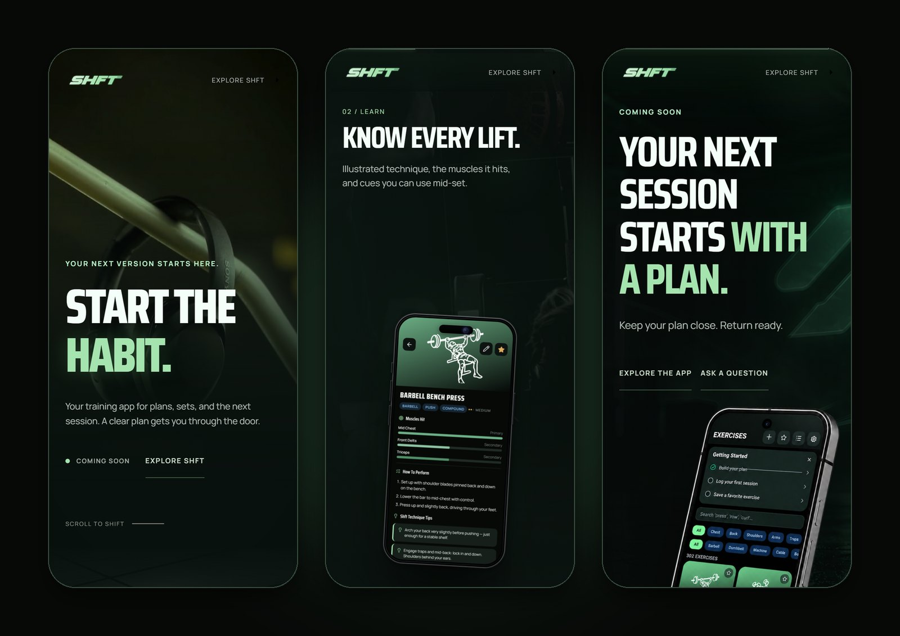
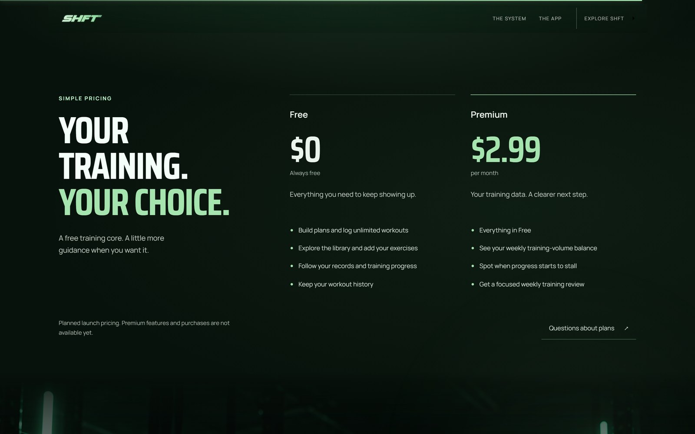
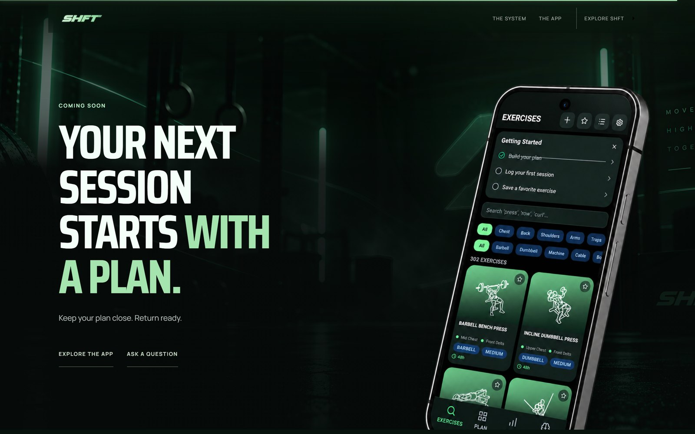

<div align="center">


### Start the habit.

The landing page for **Shft** — the gym planner and workout tracker that turns
scattered sessions into a repeatable system.

<br />

[**Visit the site →**](https://shftapp.vercel.app)
&nbsp;&nbsp;·&nbsp;&nbsp;
[The system](#the-shft-system)
&nbsp;&nbsp;·&nbsp;&nbsp;
[Craft](#craft)
&nbsp;&nbsp;·&nbsp;&nbsp;
[Run it](#run-it-locally)

<br />


<br />

<a href="https://shftapp.vercel.app"></a>

</div>

<br />

## Consistency over perfect programming

Most training apps assume you already have the discipline. Shft is built for the
part that actually fails: coming back. Build a plan you will repeat, log a session
without a spreadsheet, and get a clear cue for next time the moment you reach the
top of your rep range.

This repository is the web front door for the app — a single, continuous,
cinematic scroll that tells that story in six beats.

<br />



<br />

## The Shft system

Six chapters, one pinned scene. Each step pushes the next real app screen onto the
phone like native navigation — not a crossfade.



| | Step | What it does |
|:--|:--|:--|
| **01** | **Build** | Choose a split and shape the week before the first set. |
| **02** | **Learn** | Illustrated technique, the muscles each lift hits, cues you can use mid-set. |
| **03** | **Lift** | Log sets, reps and rest without leaving the floor. |
| **04** | **Review** | Every session ends with top sets, first-time lifts and total volume. |
| **05** | **Recover** | Estimates from logged sessions show what is fresh and what needs time. |
| **06** | **Progress** | Hit the top of your range and Shft gives you the next cue. |

<br />



<br />

## Built for every screen

The same story, recomposed for the hand — not shrunk to fit it.



<br />

## Simple pricing

A free training core, always. Premium adds a clearer next step for **$2.99 / month**
— planned launch pricing, not yet on sale.



<br />

## Craft

The details that make a page feel expensive are mostly invisible. These are the ones
this build holds itself to — and checks automatically.

<table>
<tr>
<td width="50%" valign="top">

**Motion**
- One scroll engine: Lenis smoothing driving GSAP ScrollTrigger.
- Scroll-scrubbed chapters with sequential copy hand-offs — zero overlapping frames, verified at 1% scroll steps.
- A top bar that materialises into frosted glass in lockstep with scroll, identical in both directions.
- `prefers-reduced-motion` gets a complete static edition, not a broken animation.

</td>
<td width="50%" valign="top">

**Precision**
- One page gutter token: every section's content edge lands on the same vertical line at every width.
- Transform- and opacity-only animation; videos decode only while on screen.
- Hidden tabs pause all media; reading position survives OS motion-preference changes.
- No horizontal overflow at 320, 375, 414, 768 and 1440 px.

</td>
</tr>
<tr>
<td width="50%" valign="top">

**Accessibility**
- Skip link, visible focus rings, and reveal animations that never hide content from the keyboard.
- Semantic landmarks and a clean heading outline.
- Honest copy: Android-only, coming soon, pricing clearly marked as planned.

</td>
<td width="50%" valign="top">

**Delivery**
- Static Vite build on Vercel with long-lived caching for hashed assets.
- Self-hosted, preloaded fonts: zero third-party requests, zero layout shift (CLS 0.00).
- Media sized to what each screen shows: phones get cropped and lighter encodes, never desktop masters.
- Lighthouse 100 across Accessibility, Best Practices, SEO and Agentic Browsing.
- Security headers: HSTS, `nosniff`, frame denial, strict referrer and permissions policies.
- Canonical URLs, Open Graph, structured data and a sitemap for every page.

</td>
</tr>
</table>

<br />

## Run it locally

Requires Node 20.19+ (Vite 8).

```bash
npm install
npm run dev -- --host 127.0.0.1 --port 5174
```

| Command | Purpose |
|:--|:--|
| `npm run dev` | Start the Vite dev server. |
| `npm run build` | Production build into `dist/`. |
| `npm run preview` | Serve the production build locally. |
| `npm run verify` | Browser regression suite across five viewports: overflow, chapter resume, reduced motion, media playback, legal routes. |

## Structure

```text
src/
  App.jsx          The page: sections, scroll story and motion timelines
  tokens.css       Colour, type, spacing and easing tokens
  styles.css       Base layout
  overrides.css    Section design, responsive layers and the polish layer
public/
  media/           Video, imagery and real app screens
  support/ privacy/ health-data/ terms/ cookies/   Static help and legal pages
scripts/           Playwright verification and profiling
```

<br />

<div align="center">



<br />
<br />

**Shft** — Plans. Sets. Progress.

Independently designed and built by [Apostolos Peiniris](https://apostolos-peiniris.vercel.app/).
<br />
© 2026 Shft. All rights reserved.

</div>
